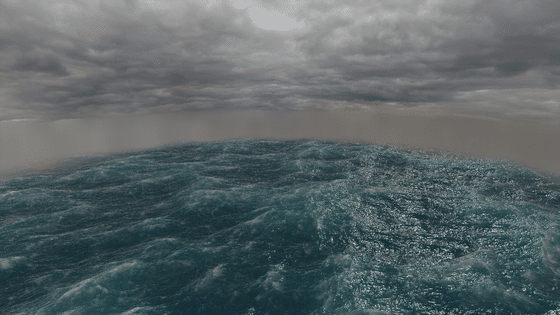
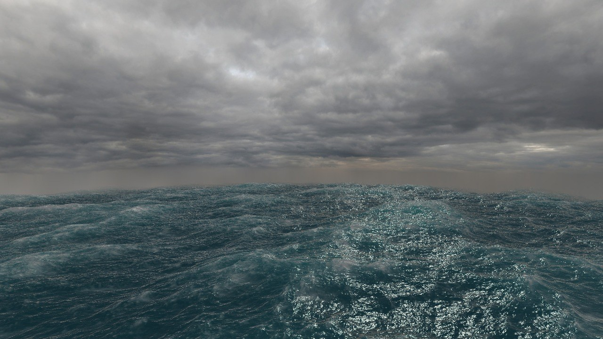

# Storm Water

Real-time stormy ocean in the browser, simulated with the FFT method from Jerry Tessendorf's
*Simulating Ocean Water* and rendered with WebGL ([regl](https://github.com/regl-project/regl)).

**[▶ Run in Browser](https://maxime-t.github.io/Storm-Water/)**
> [!NOTE]
> Hardware (GPU) acceleration must be enabled in your browser for the demo to run, and a good graphics card
> is needed for it to run smoothly.






## Features

- **FFT ocean simulation on the GPU**: the wave spectrum is evolved in frequency space and turned into a
  height field each frame by an inverse FFT written in fragment shaders.
- **JONSWAP spectrum driven by the wind**: wind speed, fetch and wind direction set the size, length and
  direction of the waves, in physical units.
- **Three cascades**: swell, medium waves and ripples are simulated on tiles of 130 m, 23 m and 5.7 m that
  never line up, so the ocean doesn't visibly repeat.
- **Choppy waves**: horizontal displacement sharpens the crests and flattens the troughs.
- **Foam** where the surface folds onto itself (Jacobian of the displacement), building up and fading over time.
- **Shading**: Fresnel reflection of the sky, sun highlights, fake subsurface scattering through the crests.
- **Large ocean from small meshes**: a grid of chunks with coarser meshes in the distance, skirts to hide
  the seams, and fog that fades the edge into the horizon.

## Controls

| Input | Action |
|---|---|
| Left mouse drag | Rotate the camera |
| Middle mouse drag | Pan |
| Mouse wheel | Zoom |
| `P` | Pause / resume the simulation |
| `H` | Hide / show the overlay |

## Running locally

The page loads JavaScript modules and shader files, which browsers block when `index.html` is opened
directly from disk (`file://`). Serve the folder with any local web server instead:

```bash
python -m http.server 8000
```

then open <http://localhost:8000>.

Requires WebGL with floating point textures (`OES_texture_float`, `OES_texture_float_linear`,
`WEBGL_color_buffer_float`), available on desktop browsers with a dedicated or integrated GPU.

## How it works

Each frame, for each of the three cascades:

1. **Spectrum** (`water_spectrum.frag.glsl`): the initial spectrum h₀(k) is generated once from the JONSWAP
   spectrum with random Gaussian amplitudes, then evolved in time with the deep water dispersion relation
   ω = √(g·|k|).
2. **Inverse FFT** (`fft_sr.js`, `water_height.frag.glsl`, `water_fft_bit_reversal.frag.glsl`): bit reversal
   then butterfly passes, horizontally then vertically, to get the height and the horizontal displacement.
3. **Derivatives** (`water_derivatives_sr.js`): the slopes (for the normals) and the derivatives of the
   horizontal displacement (for the foam) are computed in frequency space and transformed the same way.

Then:

4. **Foam** (`water_foam.frag.glsl`): foam is added where the Jacobian of the displacement drops below a
   threshold and fades out over time.
5. **Surface** (`water_displacement.vert.glsl` / `.frag.glsl`): every chunk of the ocean displaces its
   vertices with the cascades and shades the surface (sky reflection, sun, subsurface scattering, foam, fog).

## Tuning

| What | Where |
|---|---|
| Wind speed, fetch, wind direction, wave height, choppiness, cascades | `src/render/shader_renderers/water_displacement_sr.js` |
| Water colors, subsurface scattering, fog | `src/render/shaders/water_displacement.frag.glsl` |
| Foam amount and lifetime | `src/render/shaders/water_foam.frag.glsl` |
| Size of the ocean, mesh resolutions, sun | `src/scenes/final_scene.js` |
| Camera limits | `src/scene_resources/camera.js` |

## Project structure

```
index.html              entry point
src/
  main.js               setup, input and render loop
  scenes/               the ocean scene (chunks, sky, sun)
  render/
    scene_renderer.js   renders the water then the sky
    shader_renderers/   one class per shader pass (spectrum, FFT, derivatives, foam, water, sky)
    shaders/            GLSL shaders
  scene_resources/      camera and resource loading
  cg_libraries/         math, mesh and web helpers
lib/                    regl, gl-matrix, webgl-obj-loader
assets/textures/        sky texture
```

## References

- J. Tessendorf, *Simulating Ocean Water*, SIGGRAPH course notes, 2001.
- K. Hasselmann et al., *Measurements of wind-wave growth and swell decay during the Joint North Sea Wave
  Project (JONSWAP)*, 1973.
- Acerola, [*I Tried Simulating The Entire Ocean*](https://www.youtube.com/watch?v=yPfagLeUa7k), YouTube.

## Credits

Built on a WebGL course framework by Michele Vidulis, Vicky Chappuis and Krzysztof Lis. Ocean simulation and
rendering by Maxime Tscharner. Uses [regl](https://github.com/regl-project/regl),
[gl-matrix](https://glmatrix.net/) and [webgl-obj-loader](https://github.com/frenchtoast747/webgl-obj-loader).
